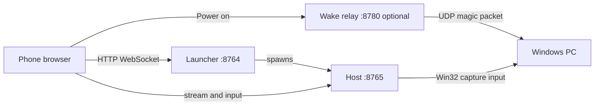
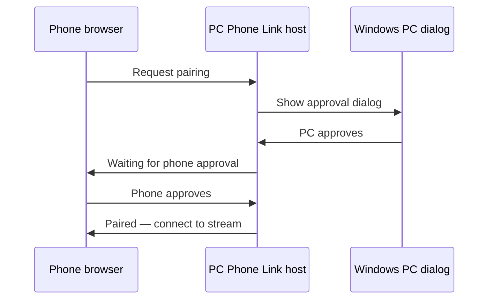

<!-- Project overview, quick start, pairing, usage, architecture, and documentation. -->
# PC Phone Link

> Control Windows apps from your phone browser — no native phone app required.

[](https://github.com/PearceMullins/pc-phone-link/actions/workflows/ci.yml)

Stream individual windows or your full desktop, send touch and keyboard input, manage windows, and optionally wake your PC — all from a phone browser on your local network.

**[Download latest release](https://github.com/PearceMullins/pc-phone-link/releases)** · **[Quick start](#quick-start)** · **[Pairing](#pairing)** · **[Usage](#usage)**

## Table of contents

- [Features](#features)
- [Requirements](#requirements)
- [Quick start](#quick-start)
- [How it works](#how-it-works)
- [Pairing](#pairing)
- [Usage](#usage)
- [Android companion](#android-companion)
- [Repository layout](#repository-layout)
- [Documentation](#documentation)
- [Security](#security)
- [License](#license)

## Features

- **Window streaming** — Capture a single app window or fullscreen desktop with adaptive WebSocket streaming and MJPEG fallback
- **Phone controls** — Touch, trackpad, scroll, keyboard, special keys, and text input
- **Window management** — List, focus, maximize, restore, and Phone Fit resize
- **Dual-approval pairing** — Approve new devices on both PC and phone; revoke trusted browsers
- **Power actions** — Lock, sleep, restart, shutdown from the phone
- **Launcher service** — Lightweight entry point that starts the main host on demand (port 8764 → 8765)
- **Wake-on-LAN** — Optional relay service and Android companion for magic-packet wake
- **Auto-start** — Install a Windows Startup shortcut for hands-free launch at sign-in

## Requirements

- **Windows 10 or 11** (64-bit) on the PC you want to control
- Phone and PC on the **same local network** (or VPN such as Tailscale)
- Windows Firewall must allow inbound connections on the ports you use (default **8764** launcher, **8765** host)
- A phone browser — no native phone app is required for streaming or input

## Quick start

### Release (recommended)

1. Download [`PCPhoneLink-Windows-x64-v1.0.0.zip`](https://github.com/PearceMullins/pc-phone-link/releases/latest) from **Releases**
2. Extract the zip and keep both executables in the same folder
3. Run **`PCPhoneLinkLauncher.exe`**
4. On your phone, open the **launcher URL** printed in the console (includes your access token)
5. Tap **Start controls**, then complete [pairing](#pairing) on the PC and phone

Release folder contents:

| File | Purpose |
| ---- | ------- |
| `PCPhoneLinkLauncher.exe` | Start this first — launcher on port 8764 |
| `PCPhoneLinkHost.exe` | Started by the launcher — main controls on port 8765 |
| `README.txt` | Quick reference |

### Python (developers)

```powershell
python -m venv .venv
.venv\Scripts\activate
pip install -r requirements.txt
python run_phone_link_launcher.py --host 0.0.0.0 --port 8764 --target-port 8765
```

Full setup, quality checks, and building release executables: [docs/DEVELOPMENT.md](docs/DEVELOPMENT.md)

### Windows Firewall

On first run, allow PC Phone Link through the firewall on **Private networks**. If prompted, approve both the launcher and host executables (or `python.exe` when running from source).

### Auto-start at sign-in

```powershell
python install_phone_link_startup.py --auto-start-host
```

Remove later with `python remove_phone_link_startup.py`.

## How it works

PC Phone Link runs one or more small web services on your PC. Your phone connects over HTTP on your LAN — there is no cloud server and no app store install required for the main UI.



| Component | Default port | Purpose |
| --------- | ------------ | ------- |
| Launcher | 8764 | Start host on demand; launcher web UI |
| Host | 8765 | Streaming, input, pairing, window list |
| Wake relay | 8780 | Send Wake-on-LAN packets (optional) |

Typical flow: open the launcher URL on your phone → tap **Start controls** → open the control URL → pair → pick a window → control your PC.

Runtime data (tokens, paired browsers, logs) is stored under:

```
%LOCALAPPDATA%\PC Phone Link\
```

## Pairing

PC Phone Link uses **dual-approval pairing**. A new phone browser must be approved on **both** the PC and the phone.

1. Start the launcher on your PC
2. Open the **launcher URL** on your phone (e.g. `http://192.168.1.10:8764/?token=YOUR-CODE`)
3. Tap **Start controls** so the host starts on port **8765**
4. Open the **control URL** on your phone (e.g. `http://192.168.1.10:8765/?token=YOUR-CODE`)
5. When the phone sends a pairing request, a **Windows dialog** appears on the PC — click **OK**
6. On the phone, tap **Approve** to finish pairing



The **access token** is printed in the PC console and saved to `%LOCALAPPDATA%\PC Phone Link\access_token.txt`. Treat it like a password — it is included in your URLs as `?token=...`.

After pairing, browsers are remembered in a trusted-device list. You can revoke access from the phone UI.

More detail: [docs/PAIRING.md](docs/PAIRING.md)

## Usage

Once paired, the phone browser is your remote control.

### Pick a window

1. Open the **Windows** panel on the phone
2. Select an app window or **Full screen** for desktop capture
3. The stream starts automatically

Use **Phone Fit** to resize the selected window to your phone viewport.

### Input modes

| Mode | Behavior |
| ---- | -------- |
| **Direct touch** | Tap and drag map directly to the PC window |
| **Trackpad** | Move a cursor relative to finger movement; tap to click |

### Keyboard and streaming

- Use the keyboard panel to type into the focused PC window
- Adjust **FPS** and **resolution** in stream settings (lower values help on slower Wi‑Fi)
- **Voice input** in the browser requires HTTPS or localhost; on plain HTTP over LAN, use your keyboard's microphone instead

### Window and power actions

- **Focus**, **Maximize**, **Restore**, and **Phone Fit** from the window panel
- **Lock**, **Sleep**, **Restart**, and **Shut down** from the power menu
- **Power on** (when configured) sends a Wake-on-LAN packet via an optional relay URL

More detail: [docs/USAGE.md](docs/USAGE.md) · Problems: [docs/TROUBLESHOOTING.md](docs/TROUBLESHOOTING.md)

## Android companion

The optional app in [`android_companion/`](android_companion/) is **not** the main phone UI. It is a shortcut helper that can:

- Send a **Wake-on-LAN** magic packet using your PC's MAC address
- **Wake and open controls** — wake the PC, wait for the host, optionally call the launcher start URL, then open the control page in your browser
- **Open controls now** — open the saved control URL when the PC is already running

Build the debug APK:

```powershell
.\android_companion\gradlew.bat -p android_companion assembleDebug
```

It is not included in the Windows release zip and is not required for normal use.

## Repository layout

| Path | Description |
| ---- | ----------- |
| [`.github/`](.github/) | CI and release workflows, issue templates, pull request template |
| [`android_companion/`](android_companion/) | Optional Android Wake-on-LAN and browser launcher helper |
| [`docs/`](docs/) | Installation, pairing, usage, troubleshooting, and development guides |
| [`packaging/`](packaging/) | PyInstaller specs and Windows release build script |
| [`phone_link/`](phone_link/) | Core Python package — host, launcher, wake relay, Win32 capture, phone web UI |
| [`run_phone_link.py`](run_phone_link.py) | Entry point for the main host (port 8765) |
| [`run_phone_link_launcher.py`](run_phone_link_launcher.py) | Entry point for the launcher (port 8764) |
| [`run_wake_relay.py`](run_wake_relay.py) | Entry point for the optional wake relay (port 8780) |
| [`install_phone_link_startup.py`](install_phone_link_startup.py) | Install Windows Startup shortcut |
| [`remove_phone_link_startup.py`](remove_phone_link_startup.py) | Remove Windows Startup shortcut |
| [`requirements.txt`](requirements.txt) | Python dependencies for running from source |
| [`pyproject.toml`](pyproject.toml) | Project metadata and version |

## Documentation

| Guide | Description |
| ----- | ----------- |
| [Installation](docs/INSTALL.md) | Release install, firewall, auto-start |
| [Pairing](docs/PAIRING.md) | Dual-approval pairing walkthrough |
| [Usage](docs/USAGE.md) | Streaming, input modes, power menu |
| [Troubleshooting](docs/TROUBLESHOOTING.md) | Common fixes |
| [Development](docs/DEVELOPMENT.md) | Run from source, build `.exe` |
| [Contributing](CONTRIBUTING.md) | Pull request guidelines |
| [Security](SECURITY.md) | Threat model and reporting |

## Security

PC Phone Link is built for **trusted local networks**. It uses **HTTP, not HTTPS**. Traffic and video are not encrypted on the wire. The access token in your URL acts as a shared secret — do not expose the service to the public internet without additional protection.

Read the full [Security Policy](SECURITY.md) before deploying on untrusted networks.

## License

MIT — see [LICENSE](LICENSE).

## Changelog

See [CHANGELOG.md](CHANGELOG.md).
