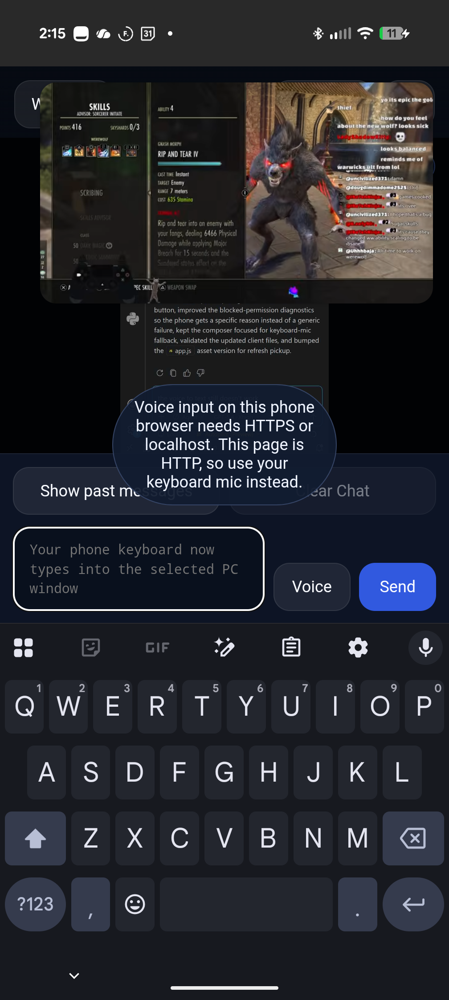
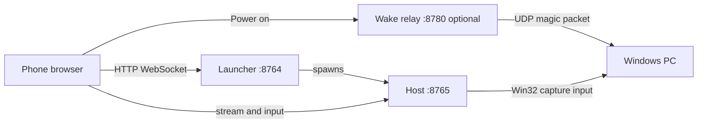

# PC Phone Link

> Control Windows apps from your phone browser — no native phone app required.

[](https://github.com/PearceMullins/pc-phone-link/actions/workflows/ci.yml)

Stream individual windows or your full desktop, send touch and keyboard input, manage windows, and optionally wake your PC — all from a phone browser on your local network.

**[Download latest release](https://github.com/PearceMullins/pc-phone-link/releases)** · **[Quick start](#quick-start)** · **[Pairing guide](docs/PAIRING.md)**



## Features

- **Window streaming** — Capture a single app window or fullscreen desktop with adaptive WebSocket streaming and MJPEG fallback
- **Phone controls** — Touch, trackpad, scroll, keyboard, special keys, and text input
- **Window management** — List, focus, maximize, restore, and Phone Fit resize
- **Dual-approval pairing** — Approve new devices on both PC and phone; revoke trusted browsers
- **Power actions** — Lock, sleep, restart, shutdown from the phone
- **Launcher service** — Lightweight entry point that starts the main host on demand (port 8764 → 8765)
- **Wake-on-LAN** — Optional relay service and Android companion for magic-packet wake
- **Auto-start** — Install a Windows Startup shortcut for hands-free launch at sign-in

## Quick start

### Release (recommended)

1. Download [`PCPhoneLink-Windows-x64-v1.0.0.zip`](https://github.com/PearceMullins/pc-phone-link/releases/latest) from **Releases**
2. Extract and run **`PCPhoneLinkLauncher.exe`**
3. On your phone, open the **launcher URL** printed in the console (includes your access token)
4. Tap **Start controls**, then approve pairing on the PC and phone — see [Pairing guide](docs/PAIRING.md)

### Python (developers)

```powershell
python -m venv .venv
.venv\Scripts\activate
pip install -r requirements.txt
python run_phone_link_launcher.py --host 0.0.0.0 --port 8764 --target-port 8765
```

Full setup: [docs/DEVELOPMENT.md](docs/DEVELOPMENT.md)

## Architecture



| Component | Default port | Purpose |
| --------- | ------------ | ------- |
| Launcher | 8764 | Start host on demand; launcher web UI |
| Host | 8765 | Streaming, input, pairing, window list |
| Wake relay | 8780 | Send Wake-on-LAN packets (optional) |

## Documentation

| Guide | Description |
| ----- | ----------- |
| [Installation](docs/INSTALL.md) | Release install, firewall, auto-start |
| [Pairing](docs/PAIRING.md) | Dual-approval pairing walkthrough |
| [Usage](docs/USAGE.md) | Streaming, input modes, power menu |
| [Troubleshooting](docs/TROUBLESHOOTING.md) | Common fixes |
| [Development](docs/DEVELOPMENT.md) | Run from source, build `.exe` |
| [Contributing](CONTRIBUTING.md) | Pull request guidelines |
| [Security](SECURITY.md) | Threat model and reporting |

## Security

PC Phone Link is built for **trusted local networks**. It uses **HTTP, not HTTPS**. The access token in your URL acts as a shared secret — do not expose the service to the public internet without additional protection.

Read the full [Security Policy](SECURITY.md) before deploying on untrusted networks.

## Android companion

The optional Kotlin app in [`android_companion/`](android_companion/) sends Wake-on-LAN packets and opens the control URL. Build from source — see [Development](docs/DEVELOPMENT.md). It is not required for normal browser-based control.

## License

MIT — see [LICENSE](LICENSE).

## Changelog

See [CHANGELOG.md](CHANGELOG.md).
