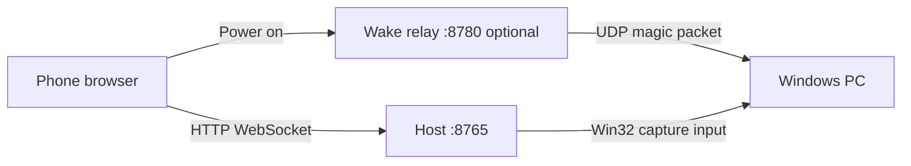
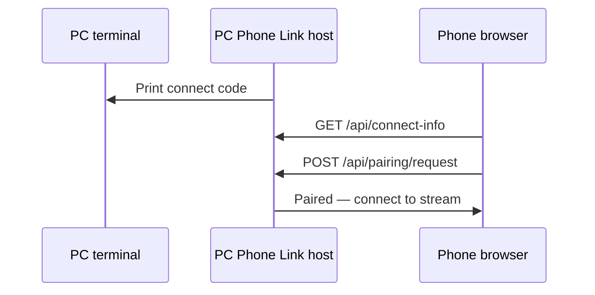

<!-- Project overview, quick start, pairing, usage, architecture, and documentation. -->

<p align="center">
  <a href="https://www.patreon.com/cw/PearceMullins">
    
  </a>
</p>

# PC Phone Link

> Control Windows apps from your phone browser — no native phone app required.

[](https://github.com/PearceMullins/pc-phone-link/actions/workflows/ci.yml)

Stream individual windows or your full desktop, send touch and keyboard input, manage windows, and optionally wake your PC — all from a phone browser on your local network.

**[Download latest release](https://github.com/PearceMullins/pc-phone-link/releases)** · **[Quick start](#quick-start)** · **[Pairing](#pairing)** · **[Usage](#usage)**

## Table of contents

- [Features](#features)
- [Requirements](#requirements)
- [Quick start](#quick-start)
- [How it works](#how-it-works)
- [Pairing](#pairing)
- [Usage](#usage)
- [Android companion](#android-companion)
- [Repository layout](#repository-layout)
- [Documentation](#documentation)
- [Security](#security)
- [License](#license)

## Features

- **Window streaming** — Capture a single app window or fullscreen desktop with adaptive WebSocket streaming and MJPEG fallback
- **Phone controls** — App touch, Mouse trackpad, viewer pan, hold-to-arm two-finger scroll, keyboard, special keys, and text input
- **Window management** — List, focus, maximize, restore, and Phone Fit resize
- **Connect code pairing** — Desktop GUI and phone show the same 4-digit code; tap Connect after confirming they match; remove connected phones from the PC window
- **Power actions** — Lock, sleep, restart, shutdown from Settings on phone and iPad; desktop Power remains available
- **Single server** — One URL on port **8765** for the full control experience
- **Wake-on-LAN** — Optional relay service and Android companion for magic-packet wake
- **Auto-start** — Install a Windows Startup shortcut for hands-free launch at sign-in

## Requirements

- **Windows 10 or 11** (64-bit) on the PC you want to control
- Phone and PC on the **same local network** (or VPN such as Tailscale)
- Windows Firewall must allow inbound connections on the port you use (default **8765** host)
- A phone browser — no native phone app is required for streaming or input

## Quick start

### Release (recommended)

1. Download [`PCPhoneLink-Windows-x64-v1.0.0.zip`](https://github.com/PearceMullins/pc-phone-link/releases/latest) from **Releases**
2. Extract the zip
3. Run **`PCPhoneLinkHost.exe`** — a desktop window opens with your connect code and connected phones
4. On your phone, open the **URL** shown in the window or console (e.g. `http://192.168.1.10:8765/`)
5. Confirm the **connect code** on the phone matches your PC, then tap **Connect**

Release folder contents:

| File | Purpose |
| ---- | ------- |
| `PCPhoneLinkHost.exe` | Main controls on port 8765 |
| `PCPhoneLinkLauncher.exe` | Deprecated wrapper — prefer `PCPhoneLinkHost.exe` |
| `README.txt` | Quick reference |

### Python (developers)

```powershell
python -m venv .venv
.venv\Scripts\activate
pip install -r requirements.txt
python run_phone_link.py --host 0.0.0.0 --port 8765
```

Full setup, quality checks, and building release executables: [docs/DEVELOPMENT.md](docs/DEVELOPMENT.md)

### Windows Firewall

On first run, allow PC Phone Link through the firewall on **Private networks**. If prompted, approve the host executable (or `python.exe` when running from source).

### Auto-start at sign-in

```powershell
python install_phone_link_startup.py
```

Remove later with `python remove_phone_link_startup.py`.

## How it works

PC Phone Link runs one or more small web services on your PC. Your phone connects over HTTP on your LAN — there is no cloud server and no app store install required for the main UI.



| Component | Default port | Purpose |
| --------- | ------------ | ------- |
| Host | 8765 | Streaming, input, connect code, window list |
| Wake relay | 8780 | Send Wake-on-LAN packets (optional) |

Typical flow: start the host on your PC → open the URL on your phone → confirm the connect code → tap Connect → pick a window → control your PC.

Runtime data (tokens, paired browsers, logs) is stored under:

```
%LOCALAPPDATA%\PC Phone Link\
```

Touch diagnostics: `%LOCALAPPDATA%\PC Phone Link\logs\gesture-events.jsonl`. Phone Settings shows path and clear/disable controls. Log excludes typed text, tokens, connection codes, IP addresses, window titles, and secrets; bounded rotation prevents unlimited growth.

## Pairing

PC Phone Link shows a **connect code** on your PC desktop window and on your phone so you can confirm you reached the right PC.

1. Start the host on your PC — the **desktop window** opens with the connect code
2. Open the **control URL** on your phone (e.g. `http://192.168.1.10:8765/`)
3. Confirm the **connect code on the phone matches your PC**
4. Tap **Connect**



After connecting, browsers are remembered in a trusted-device list. You can revoke access from the phone UI.

More detail: [docs/PAIRING.md](docs/PAIRING.md)

## Usage

Once paired, the phone browser is your remote control.

### Pick a window

1. Open the **Windows** panel on the phone
2. Select an app window or **Full screen** for desktop capture
3. After activation succeeds, PC Phone Link closes Windows, opens Viewer, and starts the stream

Viewer focus and zoom remain stable through reconnects, stream refreshes, keyboard changes, navigation, and phone rotation. **Phone Fit** resizes the PC window only when explicitly requested; viewport changes never trigger an automatic refit.

Phones and iPads use the same bottom navigation and Viewer, Windows, Keyboard, Controls, and Settings sheets in portrait and landscape. **Settings > PC power** exposes Lock, Sleep, Restart, and Shut down; destructive actions remain marked and confirmed.

### Input modes

| Mode | Behavior |
| ---- | -------- |
| **App touch** (default) | Tap clicks directly; one finger pans viewer; hold two fingers for Scroll ready then drag to scroll PC content; pinch zooms; long press right-clicks; mouse cursor stays put |
| **Mouse trackpad** | Drag moves PC mouse; tap clicks; speed and follow-mouse settings remain configurable |

### Keyboard and streaming

- Use the keyboard panel to type into the focused PC window
- Adjust **FPS** and **resolution** in stream settings (lower values help on slower Wi‑Fi)
- **Voice input** in the browser requires HTTPS or localhost; on plain HTTP over LAN, use your keyboard's microphone instead

### Window and power actions

- **Focus**, **Maximize**, **Restore**, and **Phone Fit** from the window panel
- **Lock**, **Sleep**, **Restart**, and **Shut down** from the power menu
- **Power on** (when configured) sends a Wake-on-LAN packet via an optional relay URL

More detail: [docs/USAGE.md](docs/USAGE.md) · Problems: [docs/TROUBLESHOOTING.md](docs/TROUBLESHOOTING.md)

## Android companion

The optional app in [`android_companion/`](android_companion/) is **not** the main phone UI. It is a shortcut helper that can:

- Send a **Wake-on-LAN** magic packet using your PC's MAC address
- **Wake and open controls** — wake the PC, wait for the host, then open the control page in your browser
- **Open controls now** — open the saved control URL when the PC is already running

Build the debug APK:

```powershell
.\android_companion\gradlew.bat -p android_companion assembleDebug
```

It is not included in the Windows release zip and is not required for normal use.

## Repository layout

| Path | Description |
| ---- | ----------- |
| [`.github/`](.github/) | CI and release workflows, issue templates, pull request template |
| [`android_companion/`](android_companion/) | Optional Android Wake-on-LAN and browser launcher helper |
| [`docs/`](docs/) | Installation, pairing, usage, troubleshooting, and development guides |
| [`packaging/`](packaging/) | PyInstaller specs and Windows release build script |
| [`phone_link/`](phone_link/) | Core Python package — host, launcher, wake relay, Win32 capture, phone web UI |
| [`run_phone_link.py`](run_phone_link.py) | Entry point for the main host (port 8765) |
| [`run_phone_link_launcher.py`](run_phone_link_launcher.py) | Deprecated wrapper that runs the host |
| [`run_wake_relay.py`](run_wake_relay.py) | Entry point for the optional wake relay (port 8780) |
| [`install_phone_link_startup.py`](install_phone_link_startup.py) | Install Windows Startup shortcut |
| [`remove_phone_link_startup.py`](remove_phone_link_startup.py) | Remove Windows Startup shortcut |
| [`requirements.txt`](requirements.txt) | Python dependencies for running from source |
| [`pyproject.toml`](pyproject.toml) | Project metadata and version |

## Documentation

| Guide | Description |
| ----- | ----------- |
| [Installation](docs/INSTALL.md) | Release install, firewall, auto-start |
| [Pairing](docs/PAIRING.md) | Connect code walkthrough |
| [Usage](docs/USAGE.md) | Streaming, input modes, power menu |
| [Troubleshooting](docs/TROUBLESHOOTING.md) | Common fixes |
| [Development](docs/DEVELOPMENT.md) | Run from source, build `.exe` |
| [Contributing](CONTRIBUTING.md) | Pull request guidelines |
| [Security](SECURITY.md) | Threat model and reporting |

## Security

PC Phone Link is built for **trusted local networks**. It uses **HTTP, not HTTPS**. Traffic and video are not encrypted on the wire. The connect code helps you confirm the phone reached the correct PC on your LAN — do not expose the service to the public internet without additional protection.

Read the full [Security Policy](SECURITY.md) before deploying on untrusted networks.

## License

MIT — see [LICENSE](LICENSE).

## Changelog

See [CHANGELOG.md](CHANGELOG.md).
