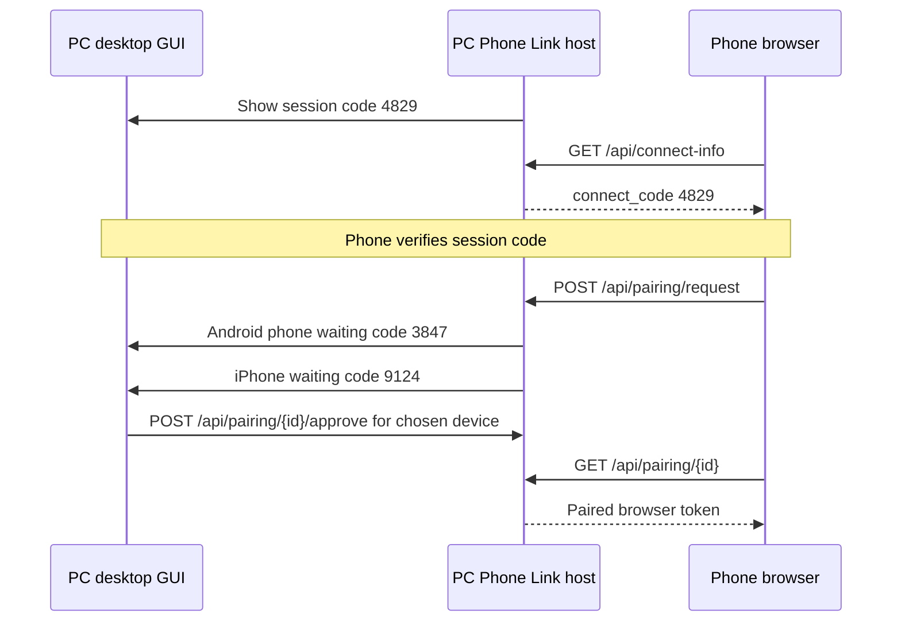

# Pairing guide

PC Phone Link uses a **session code** plus **per-device approval codes** so you control exactly which phones can connect.

## First connection

1. **Start PC Phone Link** on your PC (`PCPhoneLinkHost.exe` or `run_phone_link.py`)
2. A **desktop window** opens showing the session code and any phones waiting to connect. The same **URL** and **session code** are printed in the terminal, for example:
   ```
   http://192.168.1.10:8765/
   Connect code: 4829
   ```
3. **Open the URL** on your phone browser (no token in the URL)
4. Confirm the **session code on the phone matches your PC**
5. Tap **Connect** on the phone
6. On your PC, the phone appears under **Waiting to connect** with its own **approval code**
7. Click **Approve** only for the device you want to allow

Each waiting phone gets a **different approval code** on your PC. Other people cannot connect unless you approve their specific device.

## Connect flow



### Step by step

1. When the phone opens the control URL, it loads the current session code from the PC
2. The phone shows **Connect · CODE** — verify it matches the session code on your PC
3. Tap **Connect** on the phone to request access
4. Your PC shows the device name and a unique approval code for that phone
5. Click **Approve** on the PC for the device you want to allow
6. The phone can now pick a window and start streaming
7. Connected phones appear in the PC desktop window, where you can **Remove** them

## Return visits

After the first connect, the phone saves a paired browser token in browser storage. Trusted devices can reconnect without tapping Connect again unless you delete the saved connection.

## Headless mode

If you start the host with `--no-gui`, the PC desktop window is not shown and the PC side is approved automatically when the phone taps Connect. Use the desktop GUI for per-device approval.

## Trusted devices

Paired browsers are stored in `%LOCALAPPDATA%\PC Phone Link\paired_browsers.json`.

To **revoke** a device:

- Use **Remove** in the PC desktop window, or
- Use the trusted-devices section in the phone UI, or
- Delete entries from `paired_browsers.json` while the host is stopped

## Tips

- Use the same Wi‑Fi network on phone and PC (guest networks often block device-to-device traffic)
- Bookmark the control URL on your phone after the first successful connect
- If the session code on the phone does not match your PC, refresh the phone page or restart the host
- If two phones connect at once, each gets its own approval code so you can allow one and deny the other
- Use `--no-gui` when running from Python if you do not want the desktop window

## Next steps

- [Usage guide](USAGE.md)
- [Troubleshooting connect issues](TROUBLESHOOTING.md)
