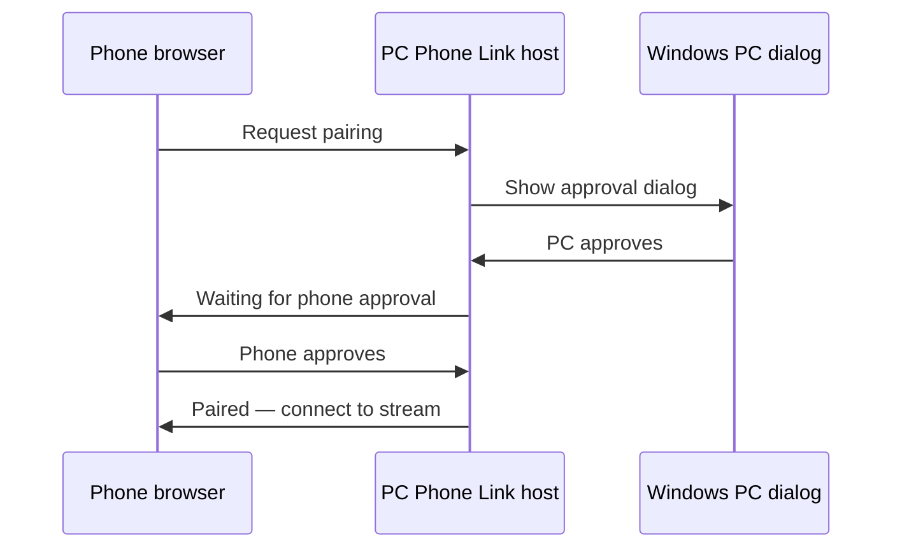

# Pairing guide

PC Phone Link uses **dual-approval pairing**. A new phone browser must be approved on **both** the PC and the phone before it can control your computer.

## First connection

1. **Start the launcher** on your PC (`PCPhoneLinkLauncher.exe` or `run_phone_link_launcher.py`)
2. **Open the launcher URL** on your phone browser (printed in the PC console, e.g. `http://192.168.1.10:8764/?token=YOUR-CODE`)
3. Tap **Start controls** on the launcher page (or use `/api/start`) so the main host starts on port **8765**
4. Open the **control URL** on your phone (also shown in the console, e.g. `http://192.168.1.10:8765/?token=YOUR-CODE`)

## Pairing flow



### Step by step

1. When the phone opens the control URL, it sends a **pairing request**
2. A **Windows dialog** appears on the PC asking whether to allow the device
3. Click **OK** on the PC to approve
4. On the phone, tap **Approve** to finish pairing
5. The phone can now pick a window and start streaming

If either side rejects the request, pairing fails and you must try again.

## Access token

The access token appears in:

- The PC console when the launcher or host starts
- `%LOCALAPPDATA%\PC Phone Link\access_token.txt`

The token is included in URLs as `?token=...`. Keep it private — anyone on your network with the token could attempt to pair.

To set a custom token when starting from Python:

```powershell
python run_phone_link_launcher.py --token MY-CUSTOM-CODE
```

## Trusted devices

After pairing, the browser is saved in `paired_browsers.json`. Trusted devices can reconnect without repeating the full flow in many cases.

To **revoke** a device, use the trusted-devices section in the phone UI or delete entries from `paired_browsers.json` while the host is stopped.

## Pairing expires

Pairing requests expire after a short window. If you wait too long between PC and phone approval, send a new request from the phone.

## Tips

- Use the same Wi‑Fi network on phone and PC (guest networks often block device-to-device traffic)
- Bookmark the control URL on your phone after the first successful pairing
- If the PC dialog does not appear, check that the host process is running and not blocked by focus-assist or remote session limits

## Next steps

- [Usage guide](USAGE.md)
- [Troubleshooting pairing issues](TROUBLESHOOTING.md)
